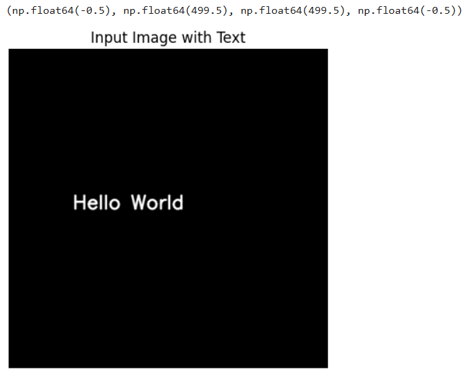
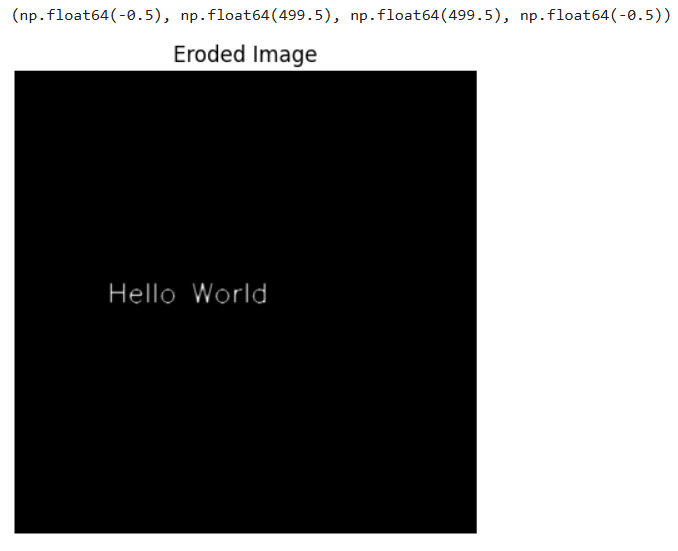
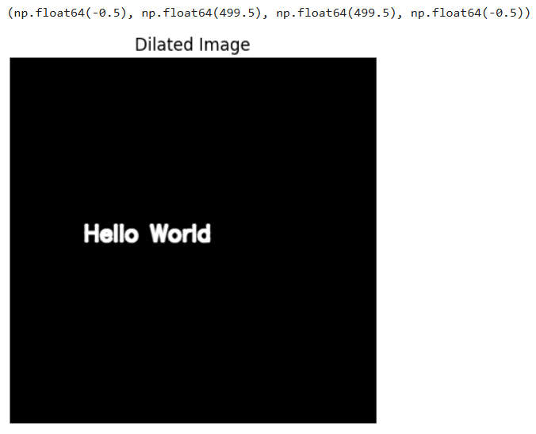

# Record-IMPLEMENTATION-OF-EROSION-AND-DILATION
# Exp-9-Implementation-of-Erosion-and-Dilation
## Name : Krithika Lakshmi M
## Reg No : 212224230134
## Aim
To implement Erosion and Dilation using Python and OpenCV.
## Software Required
1. Anaconda - Python 3.7
2. OpenCV
## Algorithm:
### Step1:
import the neccesary packages
### Step2:
create the text using cv2.put Text
### Step3:
create the structuting element
### Step4:
Erodde the image
### Step5:
Dilate the image

 
## Program:

``` 
import cv2
import numpy as np
import matplotlib.pyplot as plt

image = np.zeros((500, 500, 3), dtype=np.uint8)

font = cv2.FONT_HERSHEY_SIMPLEX
cv2.putText(image, 'Hello World', (100, 250), font, 1, (255, 255, 255), 2, cv2.LINE_AA)

plt.imshow(cv2.cvtColor(image, cv2.COLOR_BGR2RGB))  # Convert BGR to RGB for displaying
plt.title("Input Image with Text")
plt.axis('off')

kernel = np.ones((3, 3), np.uint8)

eroded_image = cv2.erode(image, kernel, iterations=1)

plt.imshow(cv2.cvtColor(eroded_image, cv2.COLOR_BGR2RGB))  
plt.title("Eroded Image")
plt.axis('off')

dilated_image = cv2.dilate(image, kernel, iterations=1)

plt.imshow(cv2.cvtColor(dilated_image, cv2.COLOR_BGR2RGB))  
plt.title("Dilated Image")
plt.axis('off')


```
## Output:

### Display the input Image



### Display the Eroded Image



### Display the Dilated Image



## Result
Thus the generated text image is eroded and dilated using python and OpenCV.